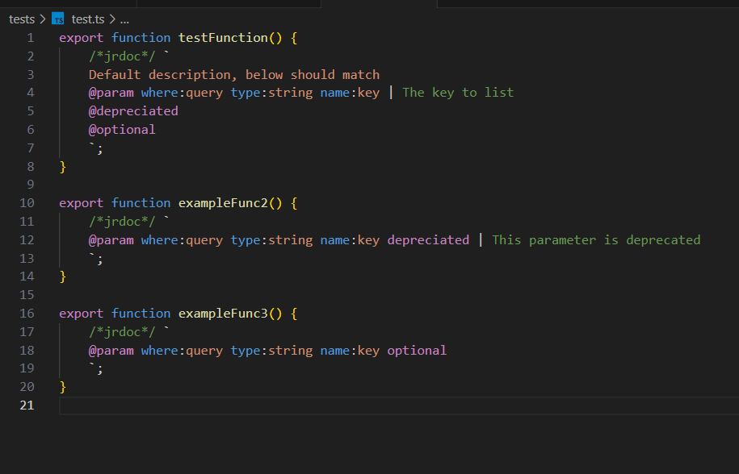

# Jrdoc Highlighting

Adds syntax highlight support for jrdoc code, placed in es6 multiline strings

## Community

-   [python-string-sql](https://github.com/ptweir/python-string-sql) - Highlight SQL code in python multiline strings
-   [es6-string-javascript](https://github.com/Zjcompt/es6-string-javascript) - Highlight JS in multiline strings
-   [es6-string-html](https://github.com/https://github.com/0x00000001A/es6-string-html) - Highlight code in multiline strings

## Contributors

-   Everyone from es6-string-html

## Installation

-   Install `jrdoc-highlighting` from extensions (`ctrl + shift + x`)

## Example

## Usage

Simply insert the comment /\*jrdoc\*/ before the template literal

> Tip: Comment in the beginning of es6 string is required

## Requirements

-   Visual Studio Code v1.19.0 and higher
-   Comment `/*jrdoc*/` before the string.

## Release Notes

### 0.8.0

Initial release

---

**Enjoy!**
